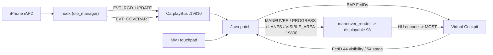

# Architecture - process topology & threading

The one-page overview; each subsystem has its own note. Start at [INDEX](INDEX.md).

## 📋 What the patch does

Production implementation for Audi MHI2Q (MU1316, QNX 6.5 ARMv7) - stock `libairplay.so` 210.81 kept
throughout:

- **Route guidance** - full HUD/BAP maneuver state ([rgd-activation](rgd/rgd-activation.md) - [bap-fctids](rgd/bap-fctids.md)) plus a custom
  3D maneuver overlay drawn over the native cluster map ([maneuver-renderer](cluster/maneuver-renderer.md) - [compositing](cluster/compositing.md)):
  arrow-fill distance progress ([bargraph-sync](rgd/bargraph-sync.md)), lane strip ([lane-guidance](rgd/lane-guidance.md)) and scrolling VC
  route text ([vc-route-text](rgd/vc-route-text.md)).
- **Cover art** - album art forwarded to the VC now-playing widget ([cover-art](hook/cover-art.md)).
- **Touchpad input** - MMI touchpad drag bridged to DPAD navigation ([touchpad-dpad](input/touchpad-dpad.md)); steering-wheel
  roller press toggles cluster route-info ([steering-wheel](input/steering-wheel.md)).

The maneuver overlay (`maneuver_render`, displayable 98, transparent when idle) composites over the
head unit's own native map (33): stock ctx 74 at rest, custom ctx 80 `{98,101,102,33}` only while
guidance is active (held after route end until the VC has faded its KDK out). Base CarPlay stays
byte-identical to stock.

## ⚙️ Components

| Component | Type | Output | Topic |
|---|---|---|---|
| `hook/` | C (ARM32 QNX), `LD_PRELOAD` into `dio_manager`; exports exactly 5 interposers | `libcarplay_hook.so` | [iap2-interception](hook/iap2-interception.md) [cover-art](hook/cover-art.md) [integration-seam](hook/integration-seam.md) |
| `java_patch/` + `java_resources/` | Java 1.4 class overrides loaded by the HMI (`lsd`) + VC glyph table | `carplay_hook.jar` | [rgd-activation](rgd/rgd-activation.md) [display-contexts](cluster/display-contexts.md) [touchpad-dpad](input/touchpad-dpad.md) |
| `maneuver_render/` | C EGL/GLES2 + C++11 scene engine (ARM QNX / macOS) | `maneuver_render` | [maneuver-renderer](cluster/maneuver-renderer.md) [compositing](cluster/compositing.md) |

## 🗂️ Process topology

```text
smartphone_integrator            (boot-resident; spawns on phone connect)
  +- carplay_startup.sh           exec's into dio_manager (same PID)
      = dio_manager               stock libairplay 210.81 + LD_PRELOAD hook
      +- carplay_monitor.sh       per-generation renderer monitor (no hook)
          +- maneuver_render      TCP 127.0.0.1:19800  (Java -> renderer; outlives dio)

Java patch (lsd.jxe, alive from boot)
  +- CarplayBus server            TCP 127.0.0.1:19810  (hook <-> Java)
```

`LD_PRELOAD` is scoped to `dio_manager` only. See [supervisor-lifecycle](deploy/supervisor-lifecycle.md) for ownership and
[bus-protocol](hook/bus-protocol.md) for the hook<->Java link.

## 🚀 Boot / init

`dio_manager` is **not** spawned at boot - `smartphone_integrator` launches it on phone connect, so
the hook constructor fires only then. The HMI (`lsd.jxe`) starts at boot, so the Java bus server is
already `accept()`ing when the hook connects. Connect sequence: [connect](deploy/connect.md).

## 🧭 Data flow (steady state)



## 🔄 Threading (highlights)

- **hook**: iAP2 thread (recv/read hooks) - cover-art worker - bus connector/writer - 1 Hz timer -
  `altscreen` cluster-stream receiver and its short-lived command threads
  ([most-map-view](cluster/most-map-view.md)).
- **Java**: HMI EDT - `carplay-bus` (bus server IO, + `carplay-bus-writer`/`carplay-bus-reader`) -
  `carplay-cluster-switch` (single DM writer, [display-contexts](cluster/display-contexts.md)) - `carplay-rgi-presentation`
  (RouteGuidance worker: retry, viewport, route-text scroll ticks) - `BAPActionBlink` ([bargraph-sync](rgd/bargraph-sync.md)) -
  `RendererServer` accept/read + writer.
- **renderer**: EGL draw loop - TCP client to Java - progress watchdog thread
  ([maneuver-renderer](cluster/maneuver-renderer.md)) - frame-ring reader feeding the hardware
  decoder - map thread owning window 99 ([most-map-view](cluster/most-map-view.md)); no dmdt on
  this branch.

## Build, tests and deployment

The [installation guide](deploy/install.md) describes the standard M.I.B. and
manual workflows. Java compilation, tests and class inspection use the shared
Java 8 Docker image and the supplied stock bootstrap library; native code uses
the QNX Docker image. Neither component build needs a host JDK or PowerShell.

The shell component commands own the shared Java procedures in `scripts/java/`.
Optional companion packaging consumes those commands from a committed source
export; the application does not depend on the tooling checkout. The shell
commands retain the maintainer's `Tools/jxe2jar` defaults; the macOS/MU1316 paths
still need execution verification. For input overrides and component development,
see the root README. Runtime ownership is described in
[supervisor lifecycle](deploy/supervisor-lifecycle.md).

## 📚 Reverse-engineering references

iOS: [accessoryd-rgd](re/ios/accessoryd-rgd.md) - [carkitd-bonjour](re/ios/carkitd-bonjour.md) - [maps-maneuvers](re/ios/maps-maneuvers.md). Firmware:
[display-manager](re/firmware/display-manager.md) - [komo-widget-video](re/firmware/komo-widget-video.md) - [dsi-carkombi](re/firmware/dsi-carkombi.md).
