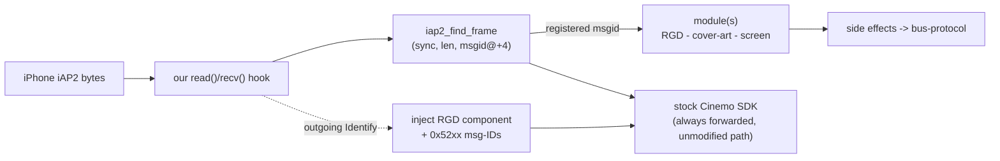

# iAP2 interception & the hook framework

`libcarplay_hook.so` is `LD_PRELOAD`ed into `dio_manager` only. Every iAP2 byte from the iPhone first
passes through our `read()` / `recv()` hooks, then continues into the stock Cinemo SDK. We don't
bypass the stock path - we intercept and inject side effects.

## 📋 Context

> iPhone iAP2 -> **iap2-interception** - parse frames, patch Identify -> modules ->
> [bus-protocol](bus-protocol.md) - to Java. Cover-art tap: [cover-art](cover-art.md).

## ⚙️ Framework

`main.c` is the module table and nothing else: it lists the shipping modules (route-guidance,
cover-art, and `altscreen`, which uses the AirPlay seams rather than iAP2 -
[most-map-view](../cluster/most-map-view.md)) in initialisation order. Nothing auto-registers from an ELF constructor - the framework
registers whatever stands in the table at its first real Cinemo boundary, calls each module's
`on_init`, and tears them down in reverse order. Everything a module wants (Identify, `msgid` filter,
session state, outgoing transport frames, the raw `NmeTransport::Recv` tap) is declared in its own
`hook_module_def_t`, so `hook_framework.c` includes no module header. `hook_framework` keeps a
priority-ordered registry and routes each parsed frame to the modules that asked for its `msgid`.
The shared object exports only the five Cinemo interposers (build-enforced allowlist) - see
[integration-seam](integration-seam.md).

## 🔍 Frame parsing

`iap2_find_frame` scans the transport buffer for the iAP2 frame sync, reads the frame length, the
`msgid` (**BE16 at offset +4**) and the payload (from +6). Route-guidance frames are `0x5200-0x5204`;
the RGD module validates the **whole** message before parsing it and hands a malformed one back to
stock untouched (see [rgd-tlv](../rgd/rgd-tlv.md)).

## 🔧 Identify patcher

On the outgoing iAP2 **Identification** message the hook injects the extra component the stock Cinemo
SDK never advertises (an EAGroup/route-guidance component) plus the `0x52xx` message IDs, so iOS
registers the accessory as route-guidance-capable and starts sending `StartRouteGuidanceUpdates`.
Without this patch iOS never emits any RGD traffic.

## ✅ Checksum

The iAP2 link checksum is applied (NEG, hard-coded) with a one-shot sanity log on the first stock
frame, so an injected/patched frame stays wire-valid.
