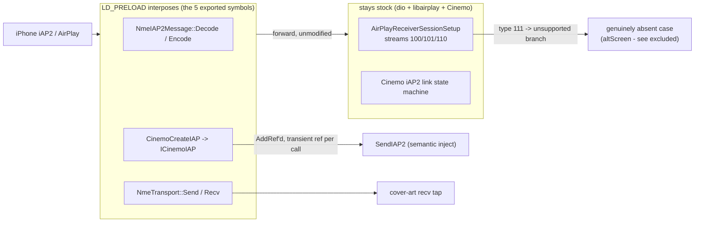

# Stock integration seam

How `libcarplay_hook.so` + the Java patch dock onto the **shipped** MU1316 / MHI2Q stack
(QNX 6.5 ARMv7, stock `dio_manager` + stock `libairplay.so` 210.81 + stock Cinemo). This note keeps
only the non-altScreen conclusions of the seam audit and marks each against current code:
**[x] = matches this branch**, **(!) = open / diverged from the re-notes**.

> The audit does **not** support replacing stock `libairplay`. Every native conclusion comes from the
> real shipped binaries; `Patches/libairplay-mhi2q` was excluded as an authority.

## 📋 Context

> Docks onto stock via real PLT/GOT seams. Frame parse + Identify patch -> [iap2-interception](iap2-interception.md);
> the `NmeTransport::Recv` tap feeds [cover-art](cover-art.md). Whole-system picture: [architecture](../architecture.md).
> **Excluded here** (altScreen-specific): iOS 26.6 altScreen contract, stream-111 ownership/reconnect,
> and the tiled-NV12->RGBA decode/presentation path.

## 🔍 What LD_PRELOAD can really intercept [x]

The old blanket rule *"a library's calls to its own exports always bypass `LD_PRELOAD`"* is **false**
for this binary. Correct rule: **classify each callsite as PLT/GOT (interposable) or direct/local
(bypassed)** - being exported is not sufficient. RE traced these as genuine PLT/GOT seams:

- `AirPlayCopyServerInfo` - called through PLT by stock libairplay itself (`_requestProcessInfo`); the working `/info` advertisement seam.
- `AirPlayReceiverSessionSetup` / `...TearDown` / `...SetNightMode` - interposable; the last is a genuine dio->libairplay boundary.
- `CinemoCreateIAP` - genuine dio->Cinemo (libNmeSDK) boundary.

The hook interposes exactly this class of symbol and nothing else: `CinemoCreateIAP`,
`NmeIAP2Message::Decode`/`Encode` and `NmeTransport::Send`/`Recv`, plus `AirPlayCopyServerInfo`,
`AirPlayReceiverSessionSetup`, `AirPlayReceiverSessionSetSecurityInfo` and
`AirPlayReceiverSessionTearDown` (framework/airplay_seams.c, the `hook_airplay_seams_t` callbacks),
each resolved via `RTLD_NEXT`. These nine are the **only**
dynamic exports (see the export surface below). The AirPlay seams forward unchanged and run module
callbacks around stock; their only user is `altscreen` ([most-map-view](../cluster/most-map-view.md)).
`SetSecurityInfo` is called through the PLT by AirTunesServer with the phone's key. `TearDown(session,
request, reason, Boolean *outDone)` ends the whole session when the request names no streams and
sets `*outDone`; the seam reports that verdict, and all of libairplay's calls reach it through the
PLT (map14's `libairplay.so`). `SetNightMode` is not interposed. [x]

**Stock SETUP behaviour (re-notes):** `AirPlayReceiverSessionSetup` handles stream types 100/101/110;
type **111 hits the unsupported branch**. The hook is therefore not shadowing hidden stock altScreen
support - it supplies a genuinely absent case. *(RE-derived; not re-checkable from repo source.)*

## 🌐 Cinemo / NME & iAP2 injection ABI

- **NmeArray layout** `{data@+0, len@+4, capacity@+8, growth@+12}`, return 0 = success - the hook reads
  exactly `data@+0`, `len@+4`, `capacity@+8` on the Encode/Recv arrays. [x]
- **Injection object lifetime** [x] - `CinemoCreateIAP` captures the returned `ICinemoIAP` **only after
  the real factory succeeds**, `AddRef`s it before publishing under `g_fw.lock`, and every inject takes
  a **transient** `AddRef`/`Release` around the stock `SendIAP2` (worker path). Owner-PID guarded so a
  forked child never mutates the parent's COM refcount; the previous capture is released after the
  atomic swap. No parallel iAP2 transport is invented.
- **Stock frame first** [x] - `NmeTransport::Send` calls the real send, and only *after* success records
  injection context / notifies modules. LocationInfo is never consumed or used as a delayed carrier.
- The `0x5200` component schema / presence TLVs are **operationally verified, not independently proven**
  from `AirPlaySender`. *(from-re-notes.)*

## 🔄 Java replacement ABI & lifecycle

- **Outer-class ABI** - the replaced stock outer classes preserve every public/protected constructor,
  method, field and superclass/interface descriptor (`javap -protected -s`). *(from-re-notes.)*
- **Lifecycle** [x] - `CarPlayApp.onActivate` only records the desired context/generation and wakes a
  persistent **daemon lifecycle worker**; `lifecycleLock` serializes module start/stop, and the general
  state lock is **not** held across `Module.start` (former lock inversion gone). Pending modules retry.
- **Nav-status gate** (!) - present, but the class is **`ScreenNavStatusGate`** on this branch (re-notes
  say `AltScreenNavStatusGate`; renamed away from the altScreen prefix).
- **Strong context ownership** [x] (policy, deliberately > stock ABI) - while
  `ScreenModule.isConnected()`, `DisplayManagerMIB2High.switchContext` rejects every cluster-terminal
  physical context write except the one serialized `ScreenModule` worker (reconciles every **250 ms**).
- (!) **Diverged:** `isConnected()` is now `platformSupported && connected` - the intent-based
  `connected || videoAvailable` term from the re-notes is **gone**, so the "blocks a legit transition
  while video is recovering" caveat no longer applies as written. Class renamed `AltScreenModule` ->
  `ScreenModule`.
- (!) **Resolved on this branch:** the map-scale / altitude **sentinel** (`updateMapScale(15,false,
  0xffff,0xff,false)`) is removed - `GatedCombiService` now passes scale/altitude straight through so the
  cluster's native readouts stay visible. The historical "Navigation unavailable" concern is moot here.

## ⚙️ Startup, cleanup & process ownership

- [x] **LD_PRELOAD is scoped to `dio_manager` only** - `carplay_startup.sh` exports the private
  `LD_PRELOAD=$H/libcarplay_hook.so` **only immediately before `exec dio_manager`**; `carplay_monitor.sh`
  and the renderer it launches run with `LD_PRELOAD=` cleared (the renderer also with
  `GRAPHICS_ROOT=/proc/boot`). This is the operational mitigation for the fail-open process gate below.
- [x] **Supervisor grace race closed** - generation ownership is an atomic owner token
  (`/tmp/carplay_supervisor.owner`, stage + `mv`); an old monitor goes quiet as soon as the file names
  another PID, and no monitor stops renderers on dio exit. See [supervisor-lifecycle](../deploy/supervisor-lifecycle.md).
- [x] **PID reuse** - the steady check is `/proc/<pid>` existence, but any signal is preceded by an exe
  identity check (`pidin -p <pid> ar`, `cp_renderer_identity`), and an unknown answer keeps the process.
  No socket/`netstat` health check remains.

## 🔐 Hardening findings

- **FIXED - RGD module work from the ELF constructor** [x] (K1004 investigation, 2026-08-31).
  The exact hook shipped in the standalone `carplay-rgi-new` package used an RGD constructor which
  called `rgd_init()` at `dlopen` time. Registration immediately entered the logger's lazy init and
  could create its pthread while QNX `ldqnx` still held the loader lock, before iAP2 Identify. RGD is
  now registered from the framework's first real Cinemo interpose instead. The build rejects any
  reintroduced `rgd_module_init`/`rgd_module_fini` and requires `.init_array` to be exactly four bytes
  (the compiler's `frame_dummy` entry only). The one-time WARN
  `lazy runtime init complete (constructor-free; first Cinemo boundary)` is the live boundary marker.
  The standalone artifact of that fix (since superseded by later builds) had SHA-256
  `1dfee4db2d3ff836e518bd53b0adfd3652b0ba1fa112f37390fc4a9f55feedcb`.
- **FIXED - eager cover-art constructor** [x] (confirmed resolved on this branch). Cover art declares
  its `NmeTransport::Recv` tap in its module def; the framework runs its `pthread_once`-backed
  `on_init` from the lazy first-Cinemo-call boundary - **no thread is created there**. The worker is
  created lazily on the first complete image (joinable, latest-wins). The tap stays declared for the
  life of the process: shutdown quiesces copied callbacks and then **joins** the worker before stopping
  the bus, which was always the real barrier (an unregister could never stop a caller that had already
  copied the function pointer). Helper processes stay fully inert (gated on
  `hook_process_is_dio_manager`).
- **FIXED - ELF export surface** [x]. The hook compiles with `-fvisibility=hidden` and links with
  `hook/carplay_hook.exports.map` (`global:` the 9 interposers above, `local: *`). `build_hook.sh` diffs
  `nm -D --defined-only` against that allowlist and **rejects the build** on any difference, alongside
  the emutls, `.init_array == 4 bytes` and no-`rgd_module_init/fini` checks. No helper can preempt a stock
  symbol by accident.
- **FIXED - host signal dispositions** [x]. The bus's `SIGPIPE` ignore and fault-signal diagnostics go
  through `signal_guard`, which saves `dio_manager`'s previous `sigaction`s, chains fault signals to
  them, and restores them on shutdown; control signals stay untouched - see [bus-protocol](bus-protocol.md).
- **State trace** - `framework/state_trace.c` (generation-scoped startup trace of iAP2/transport
  markers) is compiled out unless `ENABLE_STATE_TRACE=1`; `build_hook.sh` never sets it, so shipping
  builds carry only inline no-op stubs.
- **P2 - fail-open process gate** (!) **open in code** (mitigated). `hook_process_is_dio_manager()` returns
  **true** when `/proc/self/cmdline` can't be opened/read (fail-open). Mitigated because the startup
  script restricts `LD_PRELOAD` to `dio_manager`; fail-closed would still be safer.
- **P2 - framework state concurrency** (!) **open.** The `ICinemoIAP` object and injection context are now
  under `g_fw.lock`, but not every read/write of the shared `g_fw.ctx` fields is under one state lock -
  it rests on stock serializing the relevant NME callbacks. No log proves a race; still an external
  assumption.

## 📌 Bottom line

The decisive native seams are present in the exact shipped binaries and are interposed correctly, the
Java outer-class ABI is preserved, and `LD_PRELOAD` is confined to `dio_manager`. The **RGD module and
logger are now constructor-free**, and the eager cover-art loader thread is gone. The two section 6
re-notes that no longer match code
(`videoAvailable` intent term, and the map-scale sentinel) have both been **simplified out** on this
branch. The export surface is an enforced 9-symbol allowlist. Remaining non-altScreen work is bounded
hardening: fail-closing the process gate, tightening `g_fw.ctx` locking, and the supervisor 2 s
ownership margin.
